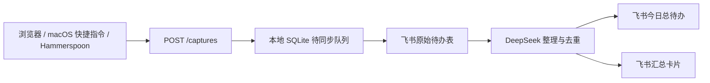

# Workless

把零散文字变成可执行待办，并在飞书里持续提醒你。

复制一段聊天记录、会议笔记或网页文字到 Workless；它会保存原始信息、同步飞书多维表、用 DeepSeek 识别待办并生成今日总待办。新增内容会在短暂防抖后自动整理，并向配置的飞书收件人发送最新卡片。

## 你会得到什么

- 一个本地快速收集入口：粘贴文字即可加入待办，无需 Hammerspoon。
- 一个飞书原始待办表和“今日总待办”输出表。
- 每项待办的优先级、明确截止日期、最小行动、参考回答与本地执行资料。
- 新增待办后自动刷新并发送汇总卡片；卡片和私聊均可标记完成。

## 先选你的收集方式

| 方式 | 是否需要 Hammerspoon | 适用场景 |
| --- | --- | --- |
| 浏览器快速收集 | 否 | 复制或输入任意文字；所有用户的默认入口。 |
| macOS 快捷指令 | 否 | 从支持分享文本的 macOS App 选中文字后发送。 |
| Hammerspoon | 是 | 需要跨多数 macOS App 的全局快捷键自动捕获。 |

Hammerspoon 是可选适配器，不承载待办整理、飞书同步或通知逻辑。没有 Hammerspoon 时，使用浏览器快速收集页即可；macOS 用户也可配置快捷指令，见 [adapters/macos](adapters/macos/README.md)。

## 快速开始：本地运行

当前版本是本地优先服务：数据保留在你的 Mac，服务仅监听 `127.0.0.1`。首次使用仍需自行配置飞书与 DeepSeek；这两项不能随开源代码提供。

### 1. 获取代码并准备环境

```bash
git clone https://github.com/huangweibin0804-lang/workless.git
cd workless
chmod +x scripts/*.sh
./scripts/bootstrap-macos.sh
```

该脚本会创建 Python 虚拟环境、安装依赖，并在缺少时生成 `.env`。你需要有可用的 `python3`；飞书同步和提醒还需要安装并登录 `lark-cli`。

### 2. 填写 `.env`

至少填写以下值：

| 配置 | 用途 |
| --- | --- |
| `FEISHU_BASE_TOKEN`、`FEISHU_TABLE_ID` | 原始待办表的位置。 |
| `FEISHU_DIGEST_TABLE_ID` | “今日总待办”输出表的位置。 |
| `FEISHU_RECIPIENT_ID` | 接收汇总卡片的用户或群。 |
| `DEEPSEEK_API_KEY` | 待办识别与整理。 |

完整字段和示例见 [`.env.example`](.env.example)。不要提交 `.env`、飞书密钥或 API Key。

### 3. 启动并检查状态

```bash
./scripts/run-local.sh
```

在浏览器打开 [http://127.0.0.1:8787/quick-capture](http://127.0.0.1:8787/quick-capture)，粘贴一条待办并提交。服务状态可通过以下地址检查：

```bash
curl http://127.0.0.1:8787/health
```

### 4. 从此处开始使用

日常只需打开快速收集页，或使用已配置的 macOS 快捷指令/Hammerspoon。新增待办同步成功后，Workless 会在默认 10 秒静默窗口结束后整理并发送一张最新汇总卡。

## 飞书准备

在原始待办 Base 创建一个表，至少包含以下列：

| 列名 | 类型 |
| --- | --- |
| 待办 | 多行文本或文本（主字段） |
| 日期 | 日期，开启时间 |
| 时间 | 文本，格式 `HH:mm` |
| 来源 | 文本 |

将飞书应用机器人添加为该 Base 的协作者并授予编辑权限。`FEISHU_BASE_TOKEN` 和 `FEISHU_TABLE_ID` 可从 Base URL 取得。输出表使用 `FEISHU_DIGEST_TABLE_ID`；服务按本地待办 ID 更新记录，避免重复新增。

如需接收飞书私聊完成指令和卡片点击，在飞书开放平台开启 `im.message.receive_v1` 与 `card.action.trigger`，并为应用授予 `im:message.p2p_msg:readonly`、`im:message:readonly` 权限。

## Workless 如何工作



- `POST /captures` 写入本地队列；飞书暂时不可用时，记录会保留并可重试。
- 每次新增或原始表变化后，服务等待短暂静默窗口，再读取全量记录、去重、按优先级排序并更新输出表。
- 资料链接默认指向本机 `127.0.0.1`，只能在运行 Workless 的 Mac 上打开。

## 不使用 Hammerspoon

### 浏览器快速收集

这是默认推荐方式。它适用于 macOS、Windows 和 Linux，只要本机服务正在运行即可：

1. 打开 `http://127.0.0.1:8787/quick-capture`。
2. 粘贴或输入待处理文字。
3. 点击“加入 Workless”。

### macOS 快捷指令

macOS 的分享菜单和服务菜单可向快捷指令传递文本。创建“发送到 Workless”快捷指令后，用户无需安装 Hammerspoon；完整步骤见 [adapters/macos/README.md](adapters/macos/README.md)。

部分 App 不会把选中文字交给快捷指令。此时复制文字后使用浏览器快速收集页即可。若要在更多 App 中通过全局快捷键自动捕获，启用 Hammerspoon 仍是更合适的增强方案。

## 常用接口

| 地址 | 用途 |
| --- | --- |
| `GET /quick-capture` | 浏览器快速收集页面。 |
| `GET /health` | 查看本地服务、飞书和模型配置状态。 |
| `POST /captures` | 给 Hammerspoon、快捷指令或其他适配器提交文字。 |
| `POST /sync/pending` | 重试所有待同步记录。 |
| `POST /digest/preview` | 生成待发送的总待办预览。 |
| `GET /todos` | 查看本地待办状态。 |

示例：重试同步队列。

```bash
curl -X POST http://127.0.0.1:8787/sync/pending
```

## 隐私与部署边界

- 当前服务仅适合本机部署；请保持 `--host 127.0.0.1`，不要直接暴露到公网。
- `.env` 中的 DeepSeek Key、飞书 Base 标识和收件人 ID 均为个人配置，不应提交到 GitHub。
- 若要做成面向所有人的云端产品，需要补充账号体系、鉴权、飞书 OAuth、每个用户的隔离存储与可访问的资料链接。当前仓库尚未提供这些能力。

## 开发与测试

```bash
.venv/bin/pytest -q
```

提示词单一维护在 [`prompts/todo_digest_system.md`](prompts/todo_digest_system.md)。修改后重启服务即可生效。

## 故障排查

| 现象 | 检查方式 |
| --- | --- |
| 快速收集页无法打开 | 运行 `./scripts/run-local.sh`，再访问 `/health`。 |
| 记录没有同步到飞书 | 检查 `FEISHU_BASE_TOKEN`、`FEISHU_TABLE_ID` 和 `lark-cli` 登录状态，再调用 `/sync/pending`。 |
| 没有收到汇总卡片 | 检查 `FEISHU_RECIPIENT_ID`、机器人权限和 `DEEPSEEK_API_KEY`，并查看 `/health`。 |
| 快捷指令收不到选中文字 | 使用复制加浏览器快速收集页，或改用 Hammerspoon。 |
